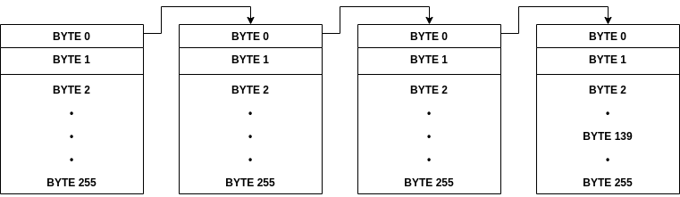

# File System Emulator
The goal of this project was to create a system where the user can create, read, update and delete files and directories in a way that maximized usable space on the drive and enabled fast read and writes without using too much main memory.

## General Structure
This file system works by dividing the space it uses into blocks of a given size (256 bytes is used here by default) in which either a file or a segment of a file is saved. Each block also has a header (2 bytes used by default) which hold meta-data about that specific block and the file of which it holds the data.

The first byte is used as a set of flags. Only one flag is used as of now to indicate whether or not the block is the last block comprising a file or not. The remaining bits in this byte can be used to store further meta-data like file types and user permissions in the future making this system extensible. The next byte can contain one of two pieces of information.

If the block is not the last block, the second byte directs us to the next block we need to complete our file. If the block is indeed the last block, the next byte tells us how many bytes inside that block are actually used by the file.

## Capacity
Since we are using only a single byte to refer to the next block (we can configure to use more) and each block has a size of 256 bytes, we can have a maximum capacity of
256 x 256 = 65536 bytes with this configuration. The limit is set to this number because if we were to save only one very large file, this would be the file size limit for that file.

We need also keep in mind that not all this space is usable as some space is used by the headers and some space will be used by the descriptor table (explained below).

One more point to note is that an average of 128 bytes will be wasted per file regardless of the file size as only the last block will not be completely filled.

## Example of a saved file
Lets say we need to save a file of size 900 bytes. Each block has a usable capacity of 254 bytes in our default configuration so we would need a total of 4 blocks. The first 3 will be fully filled and the last will will have 138 bytes of data saved.



BYTE 0 in the first 3 blocks tell us that this block is not the last block in our chain by setting their first bit to 1. BYTE 1 in the first 3 blocks have the ID of the next block in the chain. The last block is different. BYTE 0 here tells us that this is the final block and BYTE 1 tells us how many bytes of data we need to read in this block which in this case is 128 so we read from BYTE 2 to BYTE 129.

After reading this data we can merge the bytes and decode them.

## Descriptor File
The descriptor is a special file that every instance of this file system will have. It is always assigned the first block in the storage and contains information about which blocks are *dead blocks* i.e. had a file saved in them in the past but are now not used. This is useful information to assign blocks to new file and avoid defragmentation. Below is an example of a descriptor file.

```
------ Descriptor File -------

Dead Block IDs: [1, 7, 9]

Largest Used Block ID: 12

--- End of Descriptor File ---
```

The dead block IDs array tells us that block 1, 7 and 9 are available for use. We can also see that the largest block used so far is 12. In case we run out of dead blocks we will use block 13 for the next file.

## Directories
Directories in our system are also files that contain the names and addresses of its contents which are other files and sub directories.

## Project Structure
**cli.py** Run to interact with the fily system.
**config.py** Contains configuration constants for the data store.
**src/data_store.py** Class that provides the API to the file system.
**src/block.py** Abstraction for storage block.
**src/file_typs** Our system currently supports 3 file types. Two of these (Directory and BlockManager) are needed for the internal workings of the system and the third (Generic) is intended to be used by the user to save byte streams.